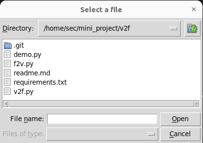
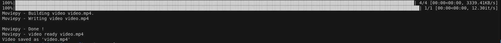
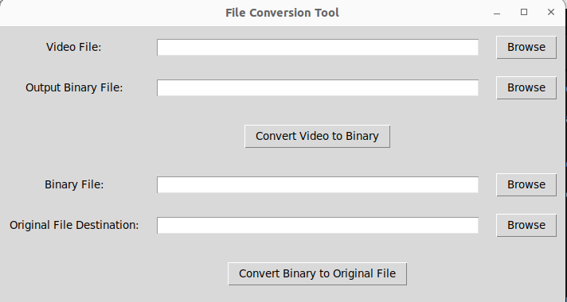

### File to Binary and Binary to Video 

### Video to Binary and Binary to File 

This project provides tools to perform conversions between files and binary data, and between binary data and video files. You can use these utilities to:

- Convert any file (e.g., text, image, etc.) into binary format and restore it from binary.
- Encode binary data into a video file.
- Decode binary data from a video file and convert it back to the original file format.

   

### Features
- **File to Binary**: This tool takes a file as input and converts it into binary format.
- **Binary to File**: This tool takes binary data as input and converts it back into the original
file format.
- **Video to Binary**: This tool takes a video file as input, extracts the binary data from 
it, and saves it as a binary file.
- **Binary to Video**: This tool takes binary data as input, encodes it into a video
file, and saves it as a video file.
- **Binary to Video with Custom Video Settings**: This tool takes binary data as input,
encodes it into a video file, and saves it as a video file with custom video settings.
- **Video to Binary with Custom Video Settings**: This tool takes a video file as input,
extracts the binary data from it, and saves it as a binary file with custom video settings.
- **Binary to File with Custom File Settings**: This tool takes binary data as input,
converts it back into the original file format, and saves it with custom file settings.
- **File to Binary with Custom File Settings**: This tool takes a file as input, converts it
into binary format, and saves it with custom file settings.
- **Binary to Video with Custom Video and File Settings**: This tool takes binary data as input,
encodes it into a video file, and saves it as a video file with custom video and file
settings.
- **Video to Binary with Custom Video and File Settings**: This tool takes a video file as input
extracts the binary data from it, and saves it as a binary file with custom video and file
settings.
- **Binary to File with Custom Video and File Settings**: This tool takes binary data as input,
converts it back into the original file format, and saves it with custom video and file
settings.
- **File to Binary with Custom Video and File Settings**: This tool takes a file as input,
converts it into binary format, and saves it with custom video and file settings.
- **Binary to Video with Custom Video, File, and Audio Settings**: This tool takes binary data
as input, encodes it into a video file, and saves it as a video file with custom
video, file, and audio settings.
- **Video to Binary with Custom Video, File, and Audio Settings**: This tool takes a video
file as input, extracts the binary data from it, and saves it as a binary file with
custom video, file, and audio settings.


###  Technologys used

[](https://skillicons.dev)


### Table of Contents
1. [Installation](#installation)
2. [Usage](#usage)
3. [Features](#features)
4. [Binary to File](#binary-to-file)
5. [File to Binary](#file-to-binary)
6. [Video to Binary](#video-to-binary)
7. [Binary to Video](#binary-to-video)
8. [License](#License)

### Requirements
- Python 3.8+
- OpenCV 4.5+
- FFmpeg 4.4+
- numpy 1.20+
- scipy 1.7+
- Pillow 9.0+
- pydub 0.25+
- pyav 20.2+
- moviepy 1.0.0+
- pytz 2022.1+


### Installation
To install the required packages, run the following command:


```
git clone https://github.com/rdxkeerthi/v2f.git

```
- **Install The Requirements Package By**
```
pip install -r requirements.txt
```
```
cd v2f
```
- **To convate File to video Run** 

```
python3 f2v.py
```

- **To canvate video to Orginal File**

```
python3 v2f.py
```
### Gallery


- **Output**

 
- **Video to File**


### License
This project is licensed under the MIT License.

### Contribution
Contributions are welcome! Please submit a pull request with your changes.
Feel free to submit pull requests to contribute improvements, bug fixes, or additional functionality.